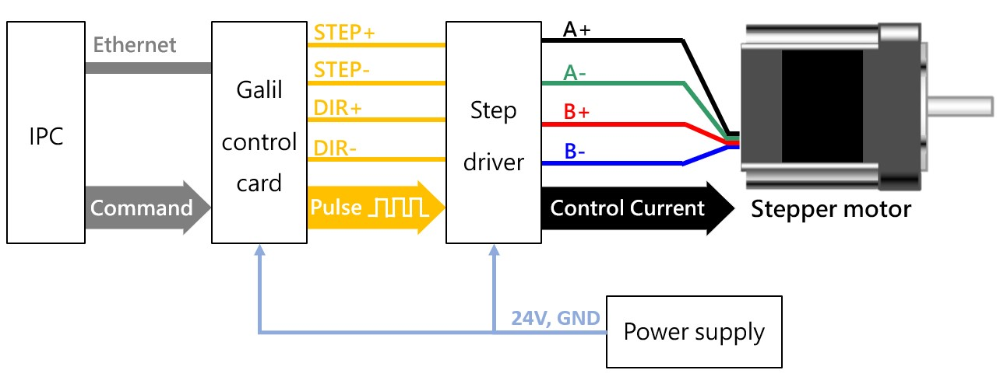
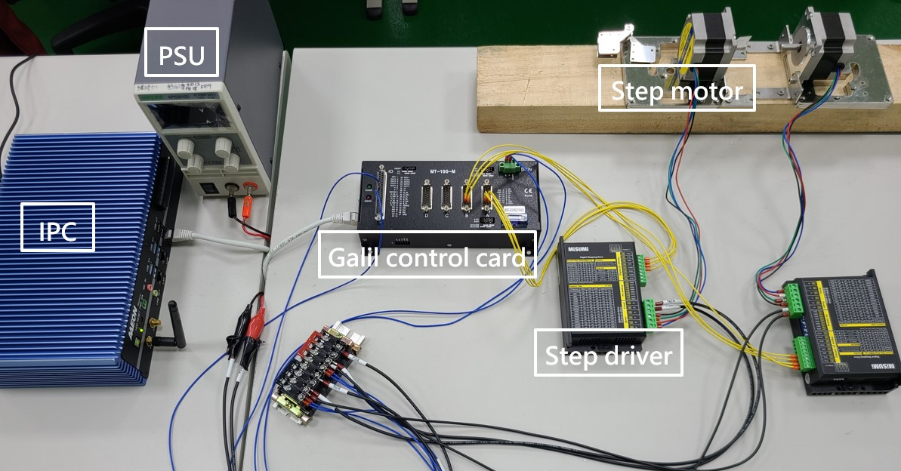

# Robot arm development &middot; [](http://wiki.ros.org/noetic) [](https://ros-planning.github.io/moveit_tutorials/) [](http://120.109.165.16/smartiot/IOT_Prj/Galil_DMC-B140_%E5%A6%8F%E8%9A%9A%E5%BF%92%EF%81%A4.pdf)

This is a ROS package using Moveit to control a Scara robot arm. We use Solidworks to create the robot model and URDF file, Moveit to plan the trajectory of the arm, and Galil control card to control the multi-axis motion of the robot arm.

This package includes four sub-packages:

* **Three-links URDF package:** Generated by Solidworks. Follow the sw2urdf GUI, and a ROS package with Rviz demo will be created automatically. [Solidworks to URDF tutorials](http://wiki.ros.org/sw_urdf_exporter/Tutorials/Export%20an%20Assembly)
* **My moveit controller:** Use Moveit setup assistant to create a Moveit package and choose KDL Kinematics Plugin as the kinematics solver, then you can simply plan a trajectory by dragging the end of the robot arm. [Moveit Setup Assistant](https://ros-planning.github.io/moveit_tutorials/doc/setup_assistant/setup_assistant_tutorial.html)
* **Based driver:** Create an action server to accept the joint trajectories and use Gclib (Galil's C++ API) to send our motion request to the Galil control card, and then the control card will drive the motor when it receives a new position.
* **Applications:** Move group C++ interface allows us to use API to create applications, such as collision detection, obstacle avoidance, and object attachment (todo). [Move Group C++ Interface](https://ros-planning.github.io/moveit_tutorials/doc/move_group_interface/move_group_interface_tutorial.html#)

These four sub-packages cover all basic functions for controlling a simple Scara robot. 

## Hardware Install





## Building

Download the packages to the src folder in your workspace, and then go to the root folder of the workspace using `catkin build` to build ROS packages, including `three_links`, `my_moveit_controller`, `based_driver`, and `applications`.

```
catkin build three_links my_moveit_controller based_driver applications
```

## Launch
After building all necessary packages, run the following command to open moveit and rviz simulation.
```
roslaunch based_driver moveit_to_galil.launch
```
For obstacle avoidance, keep moveit on and open another window to run the following command:
```
rosrun applications avoid_obstacle
```
Then click the `next` button on Rviz visualization toolbar to add and erase obstacles to the world.

## Demo


### [Watch full demo video](https://streamable.com/ds5ro5)

## References
* [sw_urdf_exporter/Tutorials - ROS Wiki](http://wiki.ros.org/sw_urdf_exporter/Tutorials)
* [Solidworks模型轉化為URDF檔案&範例(中文)](http://www.796t.com/content/1543141923.html)
* [MoveIt Setup Assistant — moveit_tutorials Noetic documentation](https://ros-planning.github.io/moveit_tutorials/doc/setup_assistant/setup_assistant_tutorial.html)
* [ROS中Moveit生成的轨迹如何作用与实际的机械臂(中文)](https://blog.csdn.net/shenyan0712/article/details/89516576)
* [trajectory_msgs/JointTrajectoryPoint](https://blog.csdn.net/shenyan0712/article/details/89516576)
* [Galil Gclib command reference](https://bl831.als.lbl.gov/~gmeigs/PDF/galil_DMC_4040_commands.pdf)
